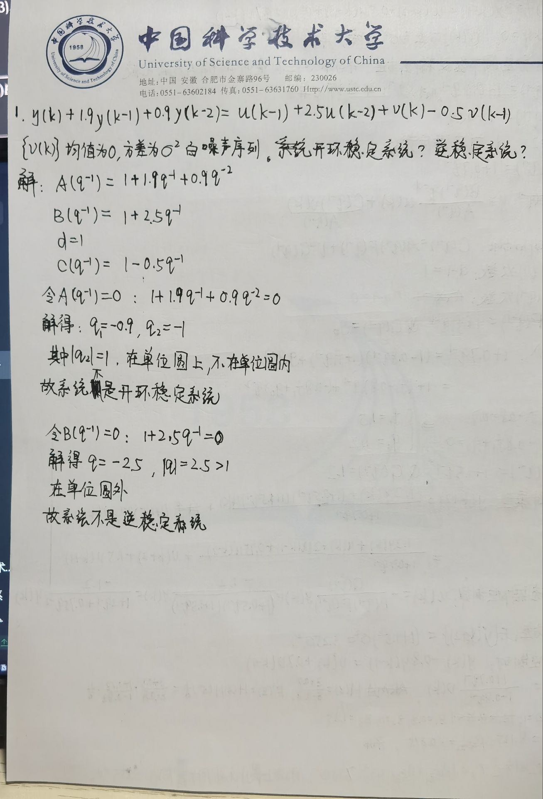
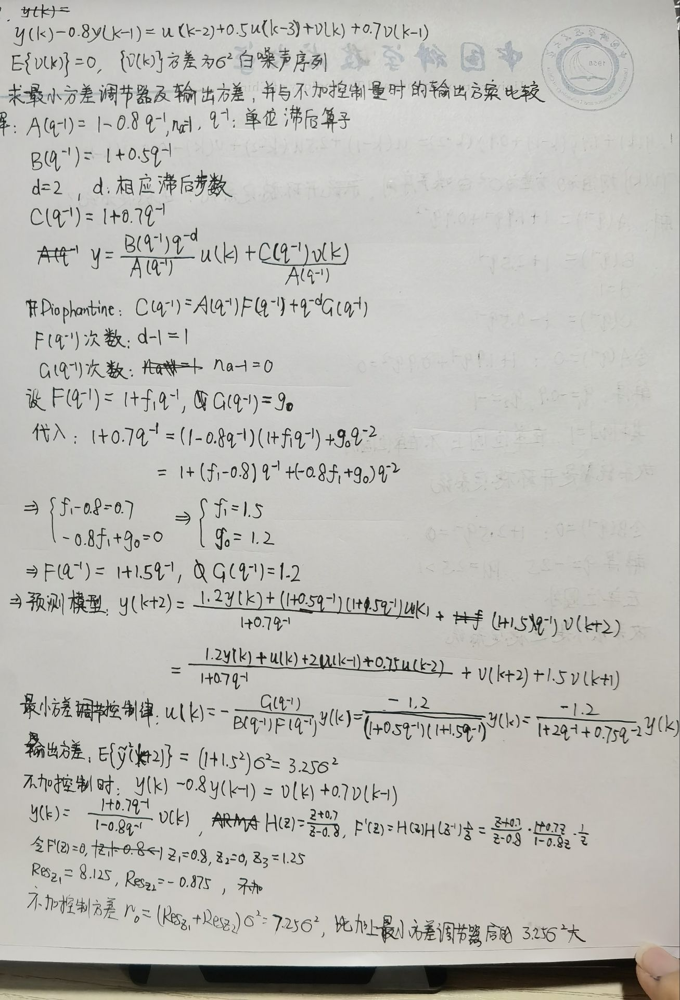
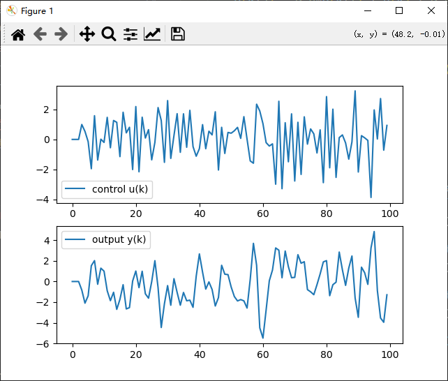
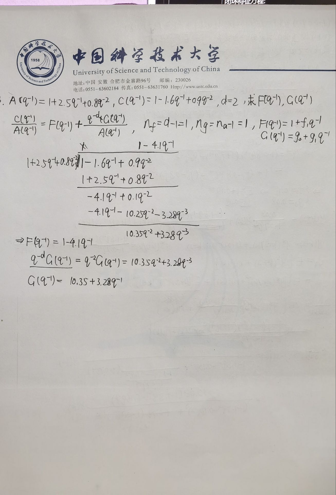
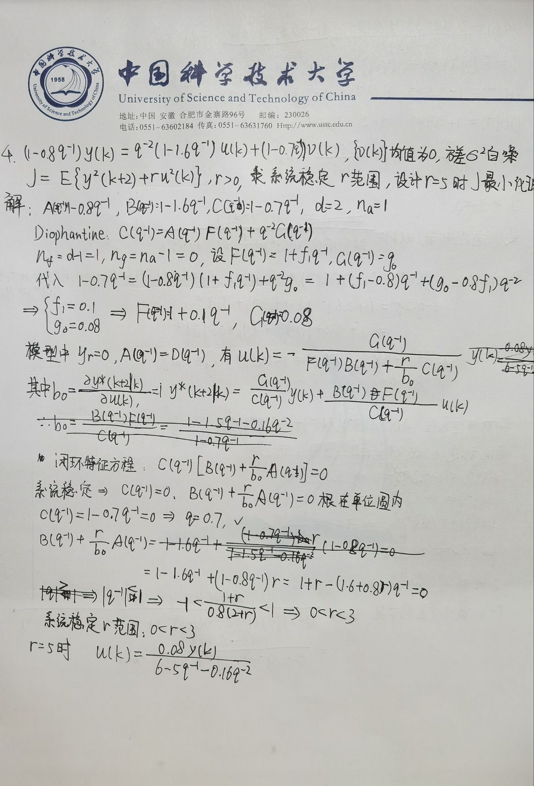
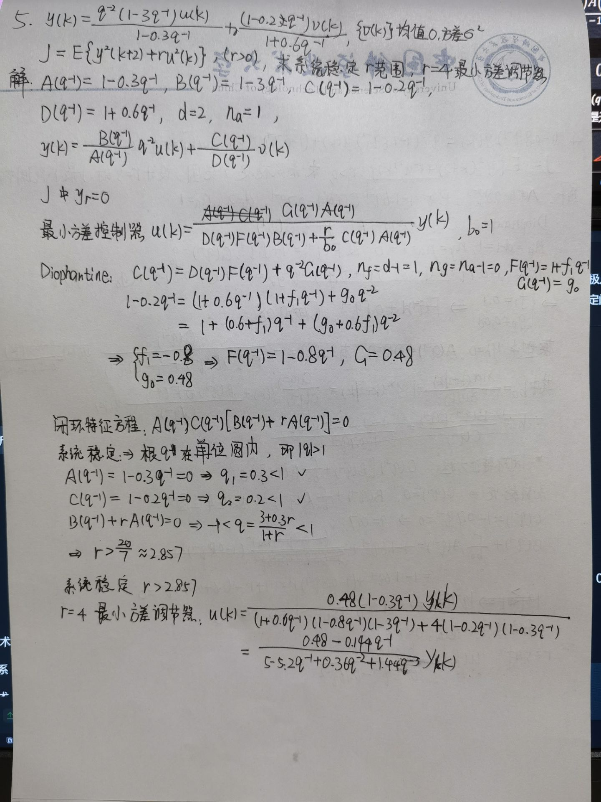
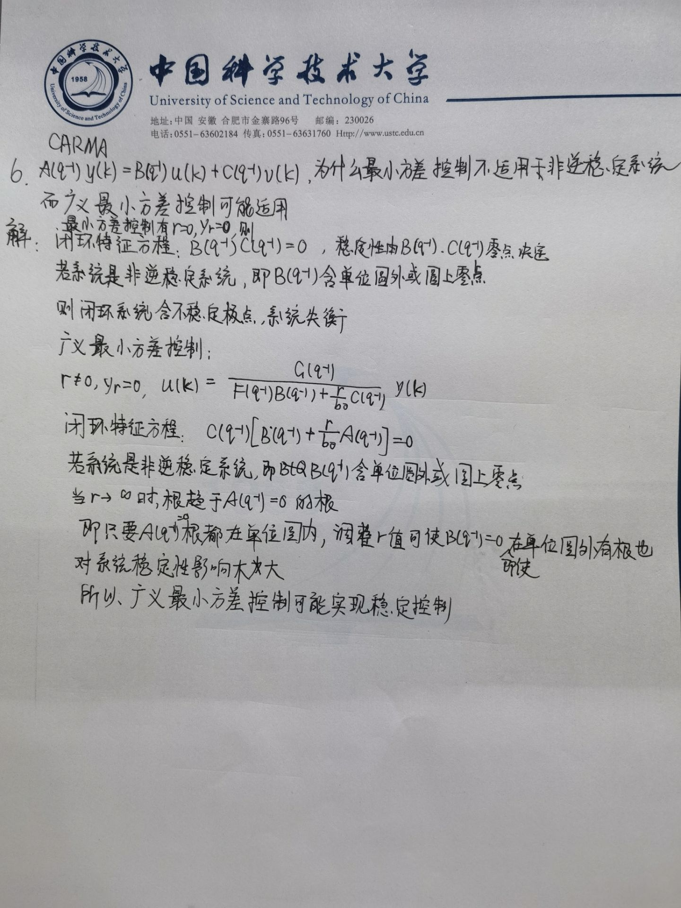

## 1



## 2



```python
import numpy as np
import matplotlib.pyplot as plt

N = 100
sigma2 = 1
v = np.random.normal(0, np.sqrt(sigma2), N+4)
y = np.zeros(N+4)
u = np.zeros(N+4)

for k in range(3, N+3):
    u[k] = -1.2*y[k] -2.0*u[k-1] - 0.75*u[k-2] 
    if k+2 < N+4:
        y[k+2] = 0.8*y[k+1] + u[k] + 0.5*u[k-1] + v[k+2] + 0.7*v[k+1]

plt.figure()
plt.subplot(2,1,1)
plt.plot(u[2:N+2], label='control u(k)')
plt.legend()
plt.subplot(2,1,2)
plt.plot(y[2:N+2], label='output y(k)')
plt.legend()
plt.show()
```



## 3



## 4



## 5



## 6

