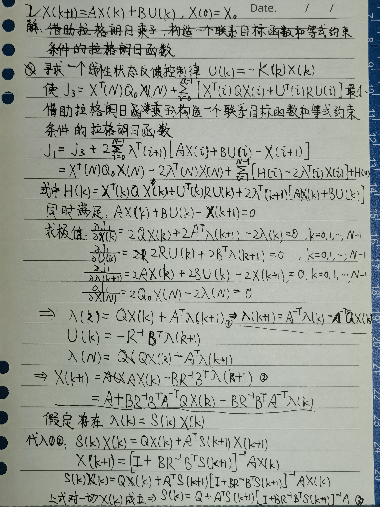
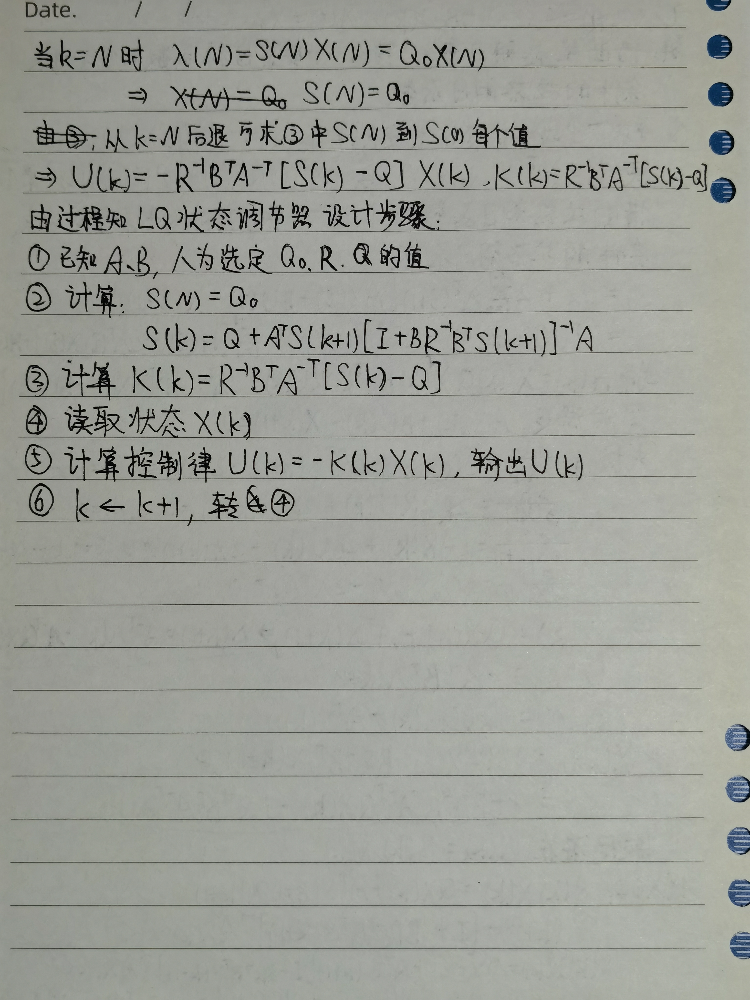
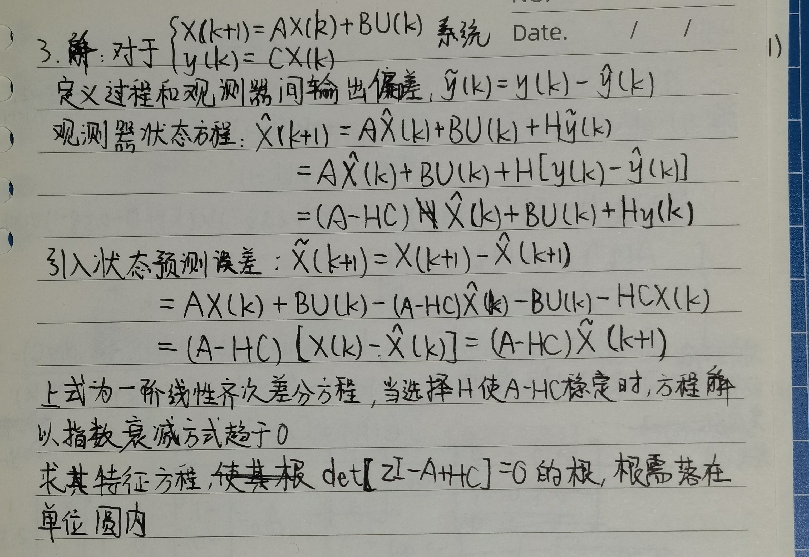
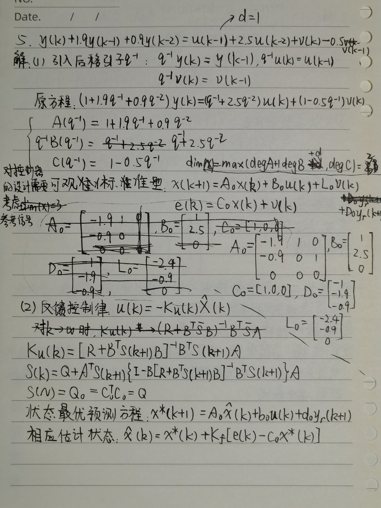
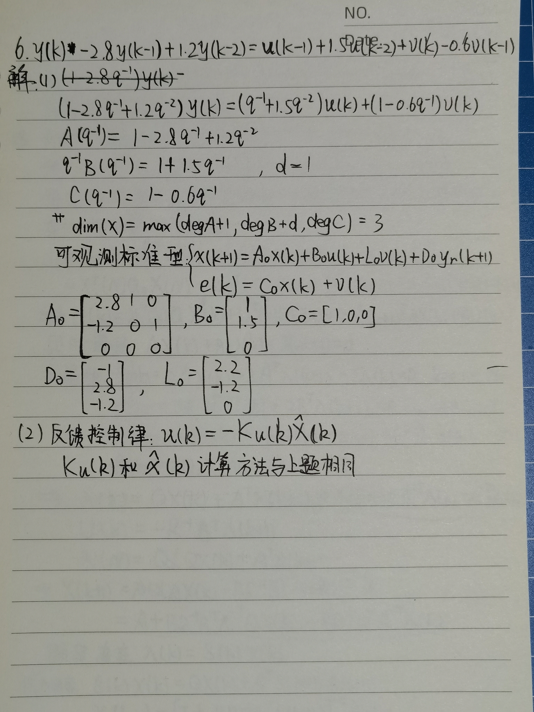
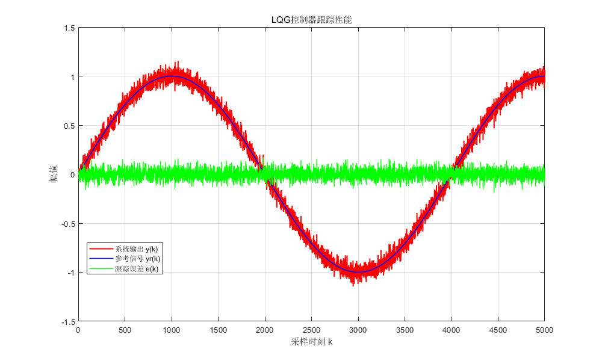

## 1 .请描述 LQ 控制与 LQG 控制的区别与联系。

### 区别：

1. 系统模型不同：LQ控制针对的是理想确定性系统，它假设系统的动态是确定且已知的，并且所有状态变量可以直接、无噪、实时地测量；LQG控制是在LQ的基础上，处理带有随机噪声的系统。
2. 控制器结构不同：LQ控制器结构是一个全状态反馈；LQG控制器由卡尔曼滤波器和LQR控制器构成。

### 联系：

均以二次型性能指标最小化为目标；LQG是LQ在随机系统中的扩展。

## 2.考虑系统 

$$
X(k+1)=AX(k)+BU(k),X(0)=X_{0}
$$

## 的 LQ 状态调节问题，使用拉格朗日乘子法求解该 LQ 最优控制问题，详细说明其设计步骤。





第3章P7-11

## 3.如何构造状态观测器？



第3章P14-16

## 4.在线性二次型高斯控制问题中，应如何设计控制器？请写出其理论依据。

线性二次型高斯控制问题中，需设计LQG控制器，分两步：

1. 采用滤波器将随机扰动和测量噪声消除，进行状态估计；
2. 根据所估计的状态进行最优控制器的设计。

理论依据：分离定理：对于具有高斯型过程干扰和量测噪声的随机线性系统，其LQG最优控制策略可分成两步完成：最优估计与最优控制，其中最优估计仅由系统方程和不确定性的相关矩阵$$𝑉,𝑁$$及估计的均方误差阵的初始值$$\hat{P}(0)$$决定，与控制无关；而最优控制只决定于系统方程和性能指标中的加权矩阵$$Q_0,Q,R$$，与系统的过程扰动及量测噪声无关，可以按照确定性系统设计，只是将确定性系统下的系统状态用最优估计状态代替，也即：只要系统方程和矩阵$$\hat{P}(0),V,N,Q_0,Q,R$$给定，状态估计与最优控制可以独立地分别进行设计。LQG系统所具有的这种特性称为分离特性。

第3章P18 P29

## 5.给定系统模型

$$
y(k)+1.9y(k-1)+0.9y(k-2)=u(k-1)+2.5u(k-2)+v(k)-0.5v(k-1)
$$

其中$$\{v(k)\}$$是均值为0，方差为$$\sigma^2$$的白噪声序列。

(1)为了设计 LQG 自校正控制器，常将输入输出模型转化为状态空间模型，请推导其可观标准型。

(2)进行 LQG 控制器设计。



## 6.给定系统模型

$$
y(k)-2.8y(k-1)+1.2y(k-2)=u(k-1)+1.5u(k-2)+v(k)-0.6v(k-1)
$$

其中$$\{v(k)\}$$是均值为0，方差为$$\sigma^2$$的白噪声序列。

(1)请将系统输入输出模型转化为状态空间表示法的能观标准型。

(2)进行 LQG 控制器设计。



## 7.根据系统输入输出描述：

$$
y(k)-0.3874y(k-1)+0.2491y(k-2)+0.0336y(k-3)\\
=1.9356u(k-1)-0.5524u(k-2)+0.2929u(k-3)\\
+v(k)+0.0987v(k-1)+0.0409v(k-2)+0.0793v(k-3)
$$

求系统跟踪给定参考输入时的输出响应$$y(k)$$及响应误差$$e(k)$$。系统各参数如下：
$$
y_r(t)=sin0.1\pi t,T_0=0.005s,t=kT_0,Q_0=Q=C_0^TC_0,R=I,v(k)=0.05*\text{randn}
$$
*请编程绘制最终的输出响应曲线，参考输入曲线及响应误差曲线图。

```matlab
clear
format long

% 系统参数定义（与图片完全一致）
a1 = -0.3874; a2 = 0.2491; a3 = 0.0336;
b1 = 1.9356; b2 = -0.5524; b3 = 0.2929;
c1 = 0.0987; c2 = 0.0409; c3 = 0.0793;

% 构建增广系统矩阵（修正图片中的维度错误）
A0 = [-a1, 1, 0, 0; 
      -a2, 0, 1, 0; 
      -a3, 0, 0, 1; 
       0, 0, 0, 0];
   
B0 = [b1; b2; b3; 0];  % 修正：列向量
C0 = [1, 0, 0, 0];
a = [a1; a2; a3];      % 修正：列向量
c = [c1; c2; c3];      % 修正：列向量

% 观测器和控制器增益设计
D0 = [-1; -a];         % 参考信号相关矩阵
L0 = [c - a; 0];       % 观测器增益（简化设计）
Kf = [1; c];           % 滤波器增益

% LQR控制器设计
Q = C0' * C0;          % 状态权重矩阵
R = 1;                 % 控制权重
[Ku, S, Eu] = dlqr(A0, B0, Q, R);  % LQR求解

% 仿真参数初始化
N = 5000;
y = zeros(N, 1);
u = zeros(N, 1);
yr = zeros(N, 1);
e = zeros(N, 1);
v = 0.05 * randn(N, 1);

% 状态初始化
xBar = 0.1 * randn(4, 1);
ABar = A0 - L0 * C0;   % 观测器系统矩阵

% 主仿真循环
for k = 4:N
    % 生成参考信号（0.0005πk 对应 0.1πt，采样周期T0=0.005）
    yr(k) = sin(0.0005 * pi * k);
    yyr = sin(0.0005 * pi * (k + 1));  % 超前一步的参考信号
    
    % 状态估计（简化观测器）
    xHat = xBar + Kf * (e(k) - C0 * xBar);
    
    % LQR控制律
    u(k) = -Ku * xHat;
    
    % 状态预测（包含前馈补偿）
    xBar = A0 * xHat + B0 * u(k) + D0 * yyr;
    
    % 输出计算（包含测量噪声）
    e(k) = C0 * xHat + v(k);      % 测量误差（近似值）
    y(k) = yr(k) + e(k);          % 系统输出
end

% 结果绘图（单图显示，如参考图片样式）
figure('Position', [100, 100, 1000, 600])
plot(y, 'r', 'LineWidth', 1.5)
hold on
plot(yr, 'b-', 'LineWidth', 1.2)
plot(e, 'g', 'LineWidth', 1)
xlabel('采样时刻 k')
ylabel('幅值')
title('LQG控制器跟踪性能')
legend('系统输出 y(k)', '参考信号 yr(k)', '跟踪误差 e(k)', 'Location', 'best')
grid on

% 显示控制器增益信息
fprintf('LQR控制器增益 Ku = \n');
disp(Ku')
fprintf('观测器增益 Kf = \n');
disp(Kf')
```


