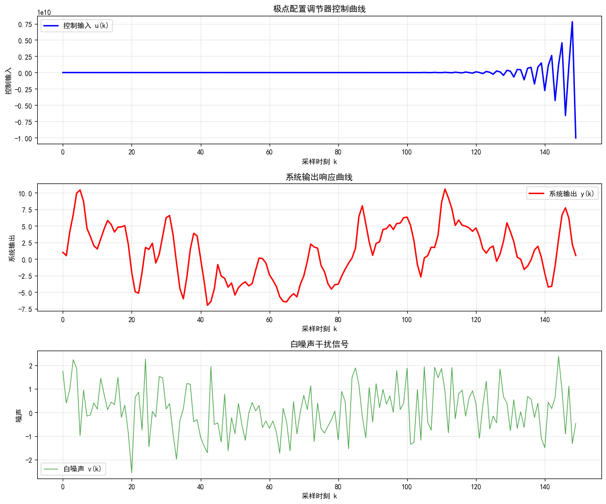

### 1.请对极点配置调节器与最小方差调节器进行比较，各自的优缺点是什么？

最小方差调节器：基于输出方差这一性能指标的最小化来设计

- 优点：在假设条件下能提供统计上最小的输出方差，控制精度最高；可实现自校正
- 缺点：对非逆稳定系统不稳定；鲁棒性较差

极点配置调节器：通过将闭环极点移到相应的期望极点上，使系统性能满足预先设定的性能要求。

- 优点：既适用于逆稳定系统，也适用于非逆稳定系统；直观、工程概念明显、鲁棒性强和适用范围广、易实现。
- 缺点：不是最优的的策略；设计参数选择复杂

### 2.请概述自校正控制系统的设计原则

自校正控制系统的设计原则：以一个成熟的控制理论为基础，嵌入一个参数估计器，并通过一个明确的连接机制，构建一个能自动校正自身参数以适应对象变化的实时闭环系统。其最终目标是使控制系统在不确定性环境中保持鲁棒的性能。

极点配置自校正调节器设计原则：对于线性定常系统，不仅系统的稳定性取决于极点的分布，而且系统的控制品质，例如上升时间、超调量、振荡次数等，在很大程度上也与极点的位置密切相关。因此，只要选择某种控制策略，将闭环极点移到相应的期望极点上，即可使系统性能满足预先设定的性能要求。

### 3.给定系统

$$
y(k)-2y(k-1)=u(k-2)+2.5u(k-3)+v(k)-0.2v(k-1)
$$

### 其中，$$\{𝜈(𝑘)\}$$是均值为0、方差为$$𝜎^2$$的白噪声序列。令期望极点构成的多项式为$$𝐴_𝑟(𝑞^{−1})=1−0.7𝑞^{-1}+0.1q^{-2}$$

### (1)求极点配置调节器。

### (2)*请编程绘制极点配置调节器的控制曲线，以及最终的输出响应曲线


```python
plt.rcParams['font.sans-serif'] = ['SimHei']
plt.rcParams['axes.unicode_minus'] = False

def simulate_pole_placement_controller(N=200):
    """
    极点配置调节器仿真
    """
    # 生成白噪声
    np.random.seed(0)
    v = np.random.randn(N)
    
    y = np.zeros(N)
    u = np.zeros(N)
    
    y[0] = 1.0
    y[1] = 0.5
    
    for k in range(2, N):
        # 极点配置控制律: u(k) = -1.08y(k-1) - 1.1u(k-1) - 1.36u(k-2)
        u[k] = -1.08 * y[k-1] - 1.1 * u[k-1] - 1.36 * u[k-2]
        # 系统输出: y(k) = 0.7y(k-1) - 0.1y(k-2) + v(k) + 1.1v(k-1) + 1.36v(k-2)
        y[k] = (0.7 * y[k-1] - 0.1 * y[k-2] + v[k] + 1.1 * v[k-1] + 1.36 * v[k-2])
    
    return y, u, v

def plot_results(y, u, v):
    """绘制结果图形"""
    N = len(y)
    
    # 创建子图
    fig, (ax1, ax2, ax3) = plt.subplots(3, 1, figsize=(12, 10))
    
    # 控制曲线
    ax1.plot(range(N), u, 'b-', linewidth=2, label='控制输入 u(k)')
    ax1.set_xlabel('采样时刻 k')
    ax1.set_ylabel('控制输入')
    ax1.set_title('极点配置调节器控制曲线')
    ax1.grid(True, alpha=0.3)
    ax1.legend()
    
    # 输出响应曲线
    ax2.plot(range(N), y, 'r-', linewidth=2, label='系统输出 y(k)')
    ax2.set_xlabel('采样时刻 k')
    ax2.set_ylabel('系统输出')
    ax2.set_title('系统输出响应曲线')
    ax2.grid(True, alpha=0.3)
    ax2.legend()
    
    # 噪声信号
    ax3.plot(range(N), v, 'g-', alpha=0.7, linewidth=1, label='白噪声 v(k)')
    ax3.set_xlabel('采样时刻 k')
    ax3.set_ylabel('噪声')
    ax3.set_title('白噪声干扰信号')
    ax3.grid(True, alpha=0.3)
    ax3.legend()
    
    plt.tight_layout()
    plt.show()

y, u, v = simulate_pole_placement_controller(150)
plot_results(y, u, v)
```



### 4.给定系统

$$
y(k)-0.8y(k-1)=u(k-2)+0.5u(k-3)+v(k)+0.7v(k-1)
$$

### 其中，$$\{𝜈(𝑘)\}$$是均值为0、方差为$$𝜎^2$$的白噪声序列。假定期望极点构成的多项式为$$𝐴_𝑟(𝑞^{−1})=1−0.6𝑞^{-1}$$，求极点配置调节器及输出方差，并与最小方差调节器的输出方差进行比较。


### 5.给定系统模型

$$
y(k)-0.6y(k-1)=u(k-2)+0.5u(k-3)+v(k)+0.8v(k-1)
$$

### 其中，$$\{𝜈(𝑘)\}$$是均值为0、方差为$$𝜎^2$$的白噪声序列。令期望极点构成的多项式为$$𝐴_𝑟(𝑞^{−1})=1−0.4𝑞^{-1}$$

### (1) 求最小方差调节器和输出方差。

### (2) 求极点配置调节器和输出方差。

### (3) 将两种调节器的输出方差与不加控制量时的输出方差比较，分析各自优缺点。


### 6.已知被控过程模型为：$$Gp(z^{-1})=\frac{y(z^{-1})}{u(z^{-1})}=\frac{bz^{-1}}{1+az^{-1}}$$，试采用极点配置设计闭环极点为$$1+q_1z^{−1}+q_2z^{−2}=0$$的 PID 型控制器，并使系统对常数干扰的稳态响应为0。


### 7.被控对象的差分方程为:

$$
 (1−1.1q^{−1}+0.3q^{−2})y(k)=q^{−2}(1+1.6q^{−1})u(k)+(1−0.65q^{−1})v(k)
$$

### 取闭环特征方程为$$A(q^{-1})=1-0.5q^{-1}$$，设计极点配置自校正调节器。


