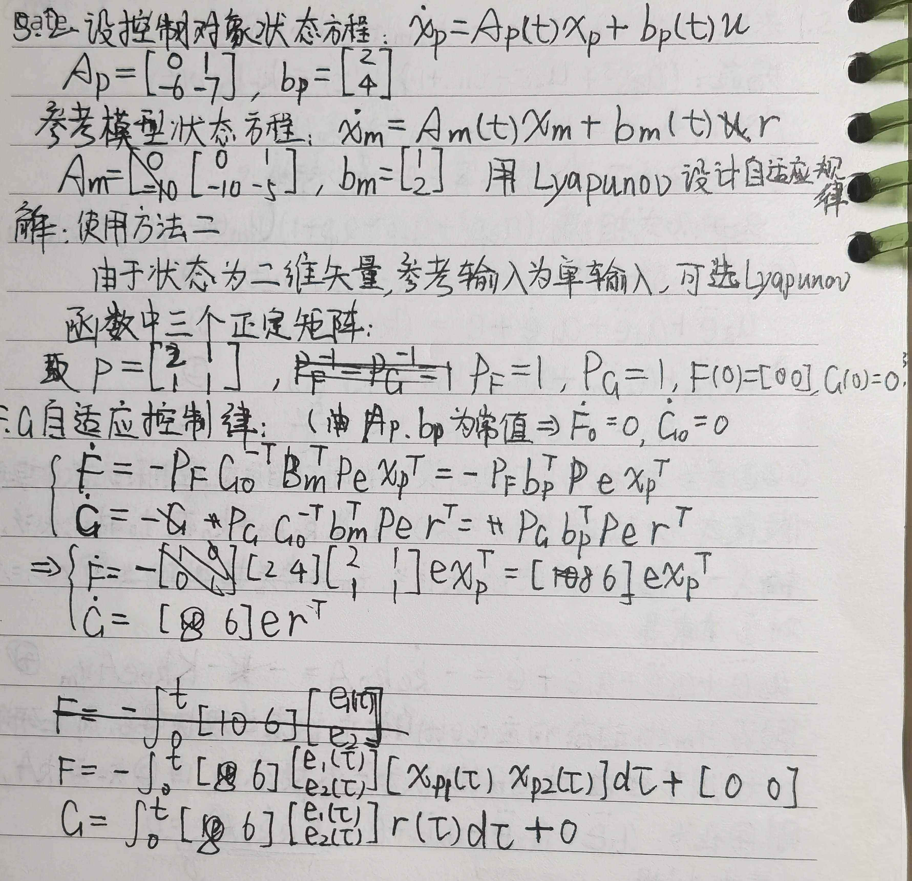
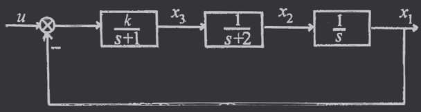
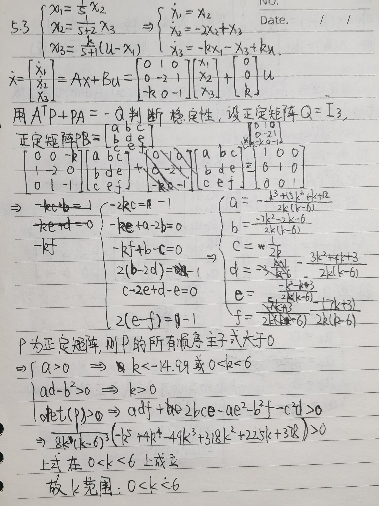
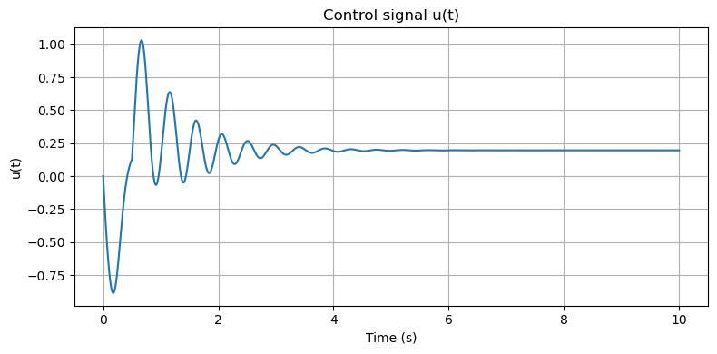
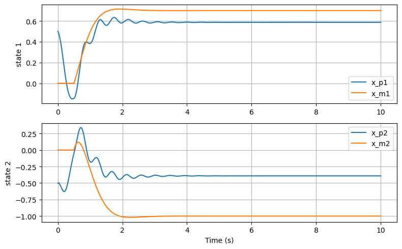
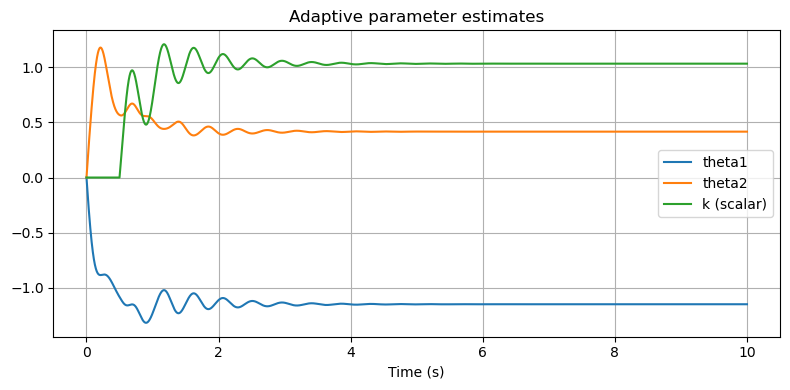
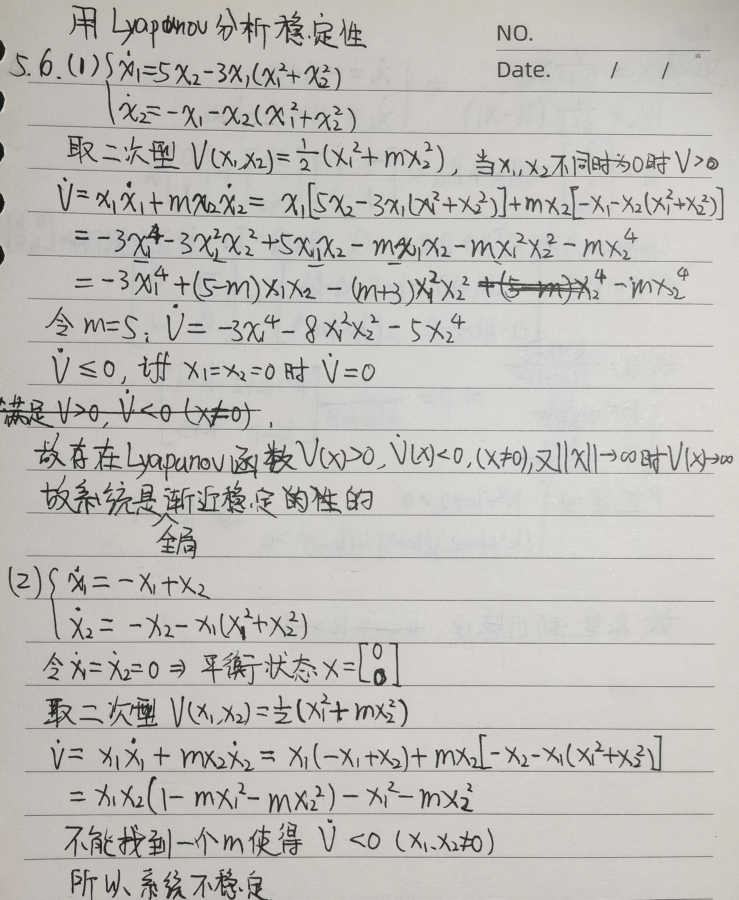
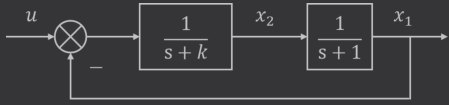
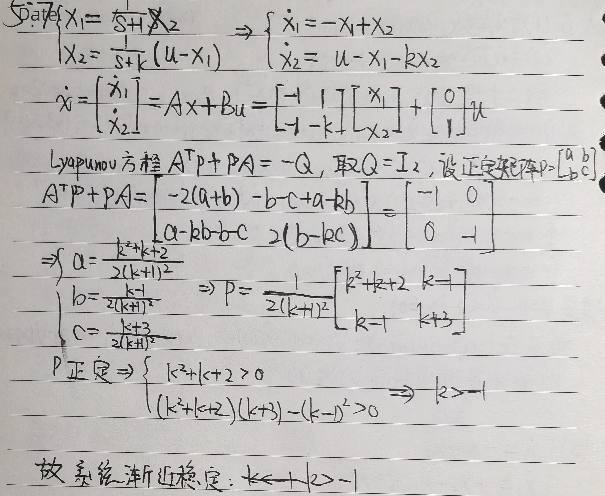

### 1 设有三阶系统，参考模型方程为

$$
(a_3s^3+a_2s^2+a_1s+1)y_m(t)=kr(t)
$$

并联可调增益系统方程为
$$
(a_3s^3+a_2s^2+a_1s+1)y_p(t)=k_ck_vr(t)
$$
式中，$$k_v$$是受环境影响的参数。试用局部参数优化法设计可调增益$$k_c$$的自适应规律，并确定使系统稳定所需的参数条件。


### 2 设控制对象的状态方程为$\dot{x}_{p}=A_{p}(t)x_{p}+b_{p}(t)u$,$A_p=\begin{bmatrix}0&1\\-6&-7\end{bmatrix}_pb_p=\begin{bmatrix}2\\4\end{bmatrix}$，参考模型的状态方程为$\dot{x}_m=A_mx_m+b_mr$，$A_m=\begin{bmatrix}0&1\\-10&-5\end{bmatrix},b_m=\begin{bmatrix}1\\2\end{bmatrix}$，用李雅普诺夫稳定性理论设计自适应规律




### 3 已知系统结构图如图所示，应用李雅普诺夫直接法确定系统渐近稳定的$k$值范围






### 4 设线性定常散系统状态方程为$x(k+1)=\begin{bmatrix}0&1&0\\0&0&1\\a&0&0\end{bmatrix}x(k)$，试确定使系统渐近稳定的$a$值范围


### 5 *请对习题5.2，编程绘制根据李雅普诺夫稳定性理论所设计控制器的控制曲线。

```python
import numpy as np
import matplotlib.pyplot as plt
from scipy import linalg

# Plant
A_p = np.array([[0., 1.],
                [-6., -7.]])

b_p = np.array([[2.],
                [4.]])  # column

# Reference model
A_m = np.array([[0., 1.],
                [-10., -5.]])

b_m = np.array([[1.],
                [2.]])

# Design: solve A_m^T P + P A_m = -Q
Q = np.eye(2)
P = linalg.solve_continuous_lyapunov(A_m.T, -Q)  # solves A^T P + P A = -Q

# Simulation parameters
T = 10.0
dt = 0.001
N = int(T/dt) + 1
t = np.linspace(0, T, N)

# Adaptation gains
gamma = 15.0
gamma_k = 15.0

# Reference command r(t): step of 1 starting at t=0.5s
def r_of_t(tt):
    return 1.0 if tt >= 0.5 else 0.0

# Initial conditions
x_p = np.array([[0.5],
                [-0.5]])   # plant initial state (column)
x_m = np.zeros((2,1))     # model initial state
theta = np.zeros((2,1))   # adaptive parameters (column)
k = np.array([[0.0]])     # adaptive scalar

# Storage
xs_p = np.zeros((N,2))
xs_m = np.zeros((N,2))
thetas = np.zeros((N,2))
ks = np.zeros(N)
us = np.zeros(N)
errs = np.zeros((N,2))

# Simulation (RK4)
for i,ti in enumerate(t):
    r = r_of_t(ti)
    # control
    u = float(theta.T @ x_p + k * r)
    # store
    xs_p[i,:] = x_p.ravel()
    xs_m[i,:] = x_m.ravel()
    thetas[i,:] = theta.ravel()
    ks[i] = float(k)
    us[i] = u
    errs[i,:] = (x_p - x_m).ravel()
    # compute derivatives function
    def deriv(xp, xm, th, kk, rr):
        e = xp - xm
        # control
        uu = float(th.T @ xp + kk * rr)
        xp_dot = A_p @ xp + b_p * uu
        xm_dot = A_m @ xm + b_m * rr
        # scalar used in adaptive law
        scalar = float((b_p.T @ (P @ e)).ravel())
        th_dot = -gamma * xp * scalar  # (2x1)
        kk_dot = -gamma_k * rr * scalar
        return xp_dot, xm_dot, th_dot, kk_dot
    
    # RK4 step
    xp1, xm1, th1, k1 = deriv(x_p, x_m, theta, k, r)
    xp2, xm2, th2, k2 = deriv(x_p + 0.5*dt*xp1, x_m + 0.5*dt*xm1, theta + 0.5*dt*th1, k + 0.5*dt*k1, r)
    xp3, xm3, th3, k3 = deriv(x_p + 0.5*dt*xp2, x_m + 0.5*dt*xm2, theta + 0.5*dt*th2, k + 0.5*dt*k2, r)
    xp4, xm4, th4, k4 = deriv(x_p + dt*xp3, x_m + dt*xm3, theta + dt*th3, k + dt*k3, r)
    
    x_p = x_p + (dt/6.0)*(xp1 + 2*xp2 + 2*xp3 + xp4)
    x_m = x_m + (dt/6.0)*(xm1 + 2*xm2 + 2*xm3 + xm4)
    theta = theta + (dt/6.0)*(th1 + 2*th2 + 2*th3 + th4)
    k = k + (dt/6.0)*(k1 + 2*k2 + 2*k3 + k4)

# Plot control u(t)
plt.figure(figsize=(8,4))
plt.plot(t, us)
plt.title('Control signal u(t)')
plt.xlabel('Time (s)')
plt.ylabel('u(t)')
plt.grid(True)
plt.tight_layout()
plt.show()

# Plot plant vs model states
plt.figure(figsize=(8,5))
plt.subplot(2,1,1)
plt.plot(t, xs_p[:,0], label='x_p1')
plt.plot(t, xs_m[:,0], label='x_m1')
plt.legend()
plt.ylabel('state 1')
plt.grid(True)
plt.subplot(2,1,2)
plt.plot(t, xs_p[:,1], label='x_p2')
plt.plot(t, xs_m[:,1], label='x_m2')
plt.legend()
plt.ylabel('state 2')
plt.xlabel('Time (s)')
plt.grid(True)
plt.tight_layout()
plt.show()

# Plot parameter estimates
plt.figure(figsize=(8,4))
plt.plot(t, thetas[:,0], label='theta1')
plt.plot(t, thetas[:,1], label='theta2')
plt.plot(t, ks, label='k (scalar)')
plt.legend()
plt.title('Adaptive parameter estimates')
plt.xlabel('Time (s)')
plt.grid(True)
plt.tight_layout()
plt.show()

# Simple print of final values
print("Final parameter estimates: theta =", thetas[-1,:], " k =", ks[-1])
```







### 6 试用李雅普诺夫稳定性理论公板下列系统的稳定性

(1) $\begin{cases}\dot{\mathrm{x}}_1=5\mathrm{x}_2-3\mathrm{x}_1(\mathrm{x}_1^2+\mathrm{x}_2^2)\\\dot{\mathrm{x}}_2=-\mathrm{x}_1-\mathrm{x}_2(\mathrm{x}_1^2+\mathrm{x}_2^2)&\end{cases}$

(2) $\begin{cases}\dot{\mathbf{x}}_1=-\mathrm{x}_1+\mathrm{x}_2\\\dot{\mathbf{x}}_2=-\mathrm{x}_2-\mathrm{x}_1(\mathrm{x}_1^2+\mathrm{x}_2^2)&\end{cases}$




### 7 已知系统结构图如表所示，试用李雅普诺夫第二法确定系统渐近稳定的$k$值范围。




